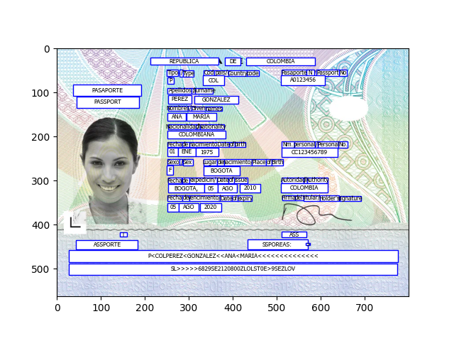

# This folder contains sample usages of OCI Document Understanding

## Text extraction

Text extraction given a document (image or pdf) is possible using OCI Document Understanding, this service will take the image and extract the text using models for OCR. OCI's model for text extraction also identifies the rexpective boxes for each part of the text.

